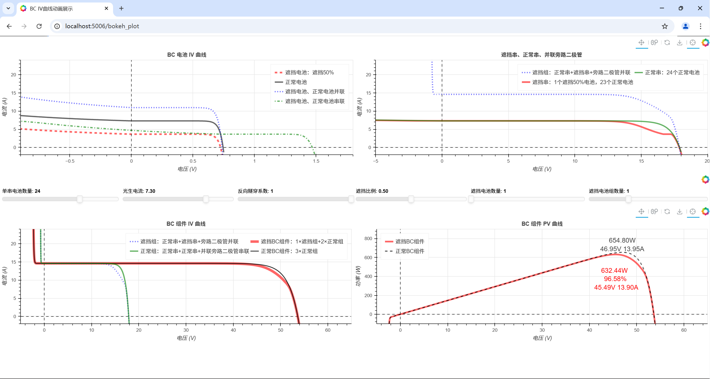

# BC_IV_characteristic
The IV characteristic curve of the BC(Back Contact) module

基于 Python 的 Bokeh 库构建交互式可视化系统，通过 IV/PV 特性曲线动态展示 BC 电池组件优异的抗遮挡性能。


**BC IV 曲线交互演示平台** —— 光伏组件遮挡特性可视化分析

为深化对 BC IV 曲线特性的理解，特打造交互式动画演示平台，支持实时调节参数并观察曲线变化：

📌 **核心功能**

通过实时调节关键参数，动态观察遮挡对光伏组件 IV 曲线的影响

（建议使用最新版 Chrome/Edge/Firefox 浏览器获得最佳体验）

🚀 **操作指南**

滑动页面中间交互式滑块调节参数，可实时调整如下参数：

▢ **遮挡比例**：单片电池的遮挡面积占比

▢ **遮挡电池数量**：单个电池串上被遮挡的电池的数量

▢ **反向隧穿系数**：反向隧穿模型系数（0 = 无隧穿效应的常规电池）

▢ **光生电流**：理想情况下单片电池的光生电流大小

▢ **单串电池数量**：与二极管并联的单个电池串的电池数量

▢ **遮挡电池组数量**：遮挡电池组——受遮挡电池串+正常电池串+二极管并联，其数量

🔄 **复位按钮**：一键恢复初始状态（刷新网页也可）

🔍 **缩放功能**：Ctrl + 鼠标滚轮 调节视图比例

🖥 **全屏模式**：F11 键 开启沉浸式体验

# 使用方法

 1. 创建测试虚拟环境

    ```shell
    conda create -n test_py39 python=3.9
    ```

2. 激活虚拟环境

   ```shell
   conda activate test_py39
   ```

3. 安装依赖

   ```shell
   conda install bokeh -y
   ```

4. 启用

   ```shell
   bokeh serve --show .\bokeh_plot.py
   ```

5. 效果图

